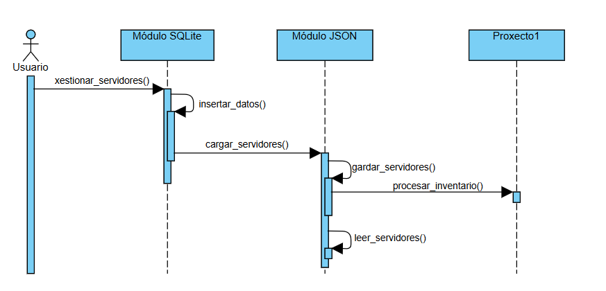

# Proxecto 2: Solución modular: Integración de inventarios de servidores (TXT + JSON + SQLite)

## Obxectivo

Deseñar un programa en Python que permita importar e xestionar inventarios de servidores, almacenalos en formato JSON, e almacenalos nunha base de datos SQLite, sobre a que lanzaranse consultas. 

---

## Entrada

Partiremos da solución do proxecto 1, no que xa procesades un ficheiro de servidores e devolvedes dúas listas (poden cambiar os nomes):
  - `lista_servers` → servidores válidos.
  - `lista_errores` → servidores con erros.

Usaredes como partida a vosa propia solución do proxecto 1 ou a miña proposta (pública a partires do día 15 de decembro).

Probablemente facedes unha chamada de probas á función ```procesar_inventario()``` dende a "raíz" do proxecto. Para que non se execute ao importalo como módulo confinádeo dentro dun bloque ```if __name__ == '__main__':```. Amósovos a miña proba protexida:

```python
#PRUEBAS
if __name__ == '__main__':
    #hay que comprobar visualmente el fichero informe_servidores.txt
    lista_servers, lista_errores = procesar_inventario("inventario.txt")


    print("Lista de servidores")
    for servidor in lista_servers:
        print(servidor)

    print("\nLista Errores")
    for error in lista_errores:
        print(error)

```

## Requisitos do proxecto 2

Teredes que implementar __dous módulos adicionáis__:

### Módulo servers_json.py
Encárgase de traspasar e ler os datos a arquivos JSON. 
Teredes que importar como módulo a solución do proxecto1. 

Neste módulo teredes dúas funcións:

1. Función ```gardar_servidores()```
   - Recupera a lista de diccionarios de servidores devolto pola función ```procesar_inventario()``` do proxecto 1, e almacénaos en formato json e indentado (ao voso gusto) nun arquivo ```lista_servidores.json```. 

2. Función ```leer_servidores()```  
   - Lee o arquivo ```lista_servidores.json``` e pásao a unha lista de diccionarios de Python, que devolverase como retorno. 
3. Función ```cargar_servidores()```
   - Orquesta as dúas funcions anteriores e devolve un diccionario: 
      - Chama a ```gardar_servidores()``` para xerar o arquivo JSON
      - Chama a ```leer_servidores()``` para leer o arquivo xerado, e devolve o diccionario retornado.

Podedes engadir as probas que queirades, pero lembrade confinalas dentro dun bloque ```__main__``` coma no caso anterior, xa que usaredes este módulo dentro do seguinte. 

### Módulo sqlite_servers.py
Xestiona o almacenamento e consultas dos serviores nunha base de datos SQLite moi sinxela. Teredes que cargar o módulo ```servers_json```para usalo na función ```insertar_datos```descrita a continuación.

>Hai distintas funcions que necesitan de conexión á base de datos. Recoméndase por sinxeleza, que as fagades en cada unha delas cun ```with``` como no exemplo, asegurando o peche da conexión ao rematar a chamada. É dicir, que non usaremos un memos obxeto conexión pasándoo entre funcions, senón que abrirase unha nova conexión en cada chamada. 

Neste módulo teredes as seguientes funcions:


1. Función ```crear_db(nombre_db)```  
   - Crea unha base de datos SQLite co nome recibido como parámetro.
   - Crear a táboa `Servidores` (facendo un ```DROP TABLE IF EXISTS``` previo para limpar datos de probas anteriores), cos campos axeitados para almacenar os servidores do noso proxecto. A chave primaria será o campo ```nombre``` do servidor. 
2. Función ```insertar_datos()```
   - Chama á función ```cargar_servidores()``` do módulo anterior, para recuperar os servidores dende un JSON en forma dunha lista de diccionarios de Python.
   - Insire na táboa ```Servidores```da base de datos SQLite creada previamente cada un dos servidores recollidos. 
   - Hai que tomar os rexistros do diccionario como _potencialmente perigosos_ por provir dende fontes alleas, polo que se deben tomar as medidas de precaución necesarias para evitar ataques SQL Injection. 
3. Función ```xestionar_servidores()```

   - Amosa ao usuario un menú coas seguintes opcions, ata elexir a opción de saída:
   ```
      1 - Crear BDD
      2 - Inserir Datos
      3 - Consultar servidores
      4 - Saír
   ```
   As opcions 1 e 2 chaman á función correspondente das anteriores.  
   A opción 3:  
   - Pide ao usuario un nome de servidor.  
   - Imprime os datos correspondentes recuperados dende a base de datos.
   - Indica, no seu caso, se non existe o nome de servidor solicitado. 

---

Adxúntase un diagrama de secuencia para visualizar a conexión entre os módulos




## Obxectivos pedagóxicos

- Aprender a integrar distintos formatos de datos (TXT e JSON) sen modificar código preexistente.  
- Practicar lectura e escritura de JSON e SQLite desde Python.  
- Implementar operacións básicas de persistencia e consulta interactiva.

